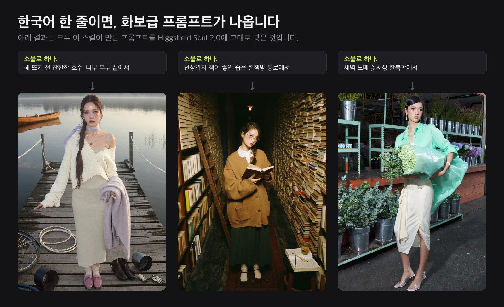
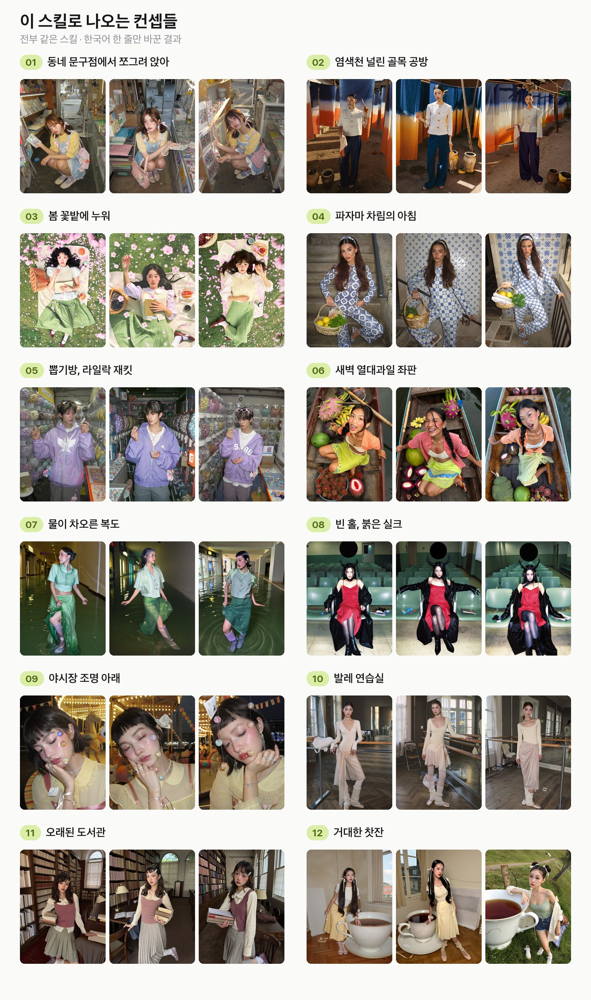
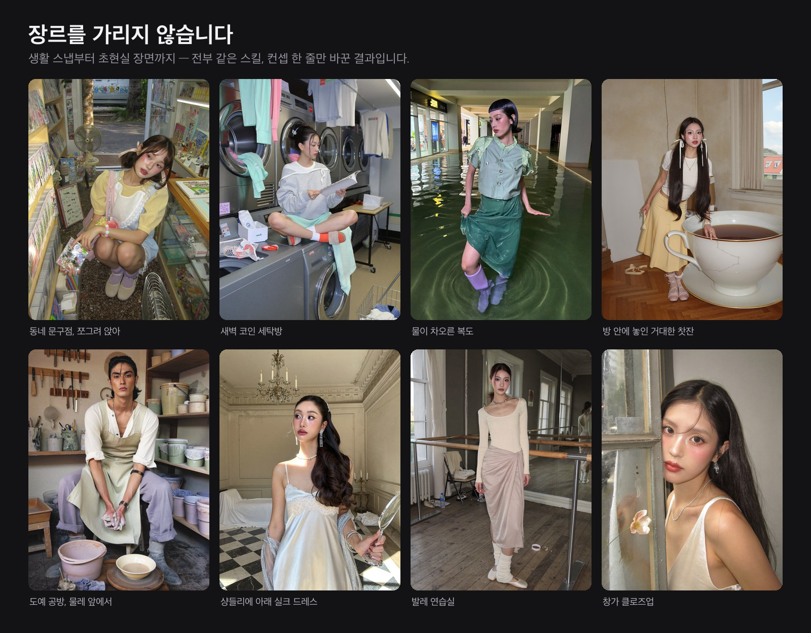
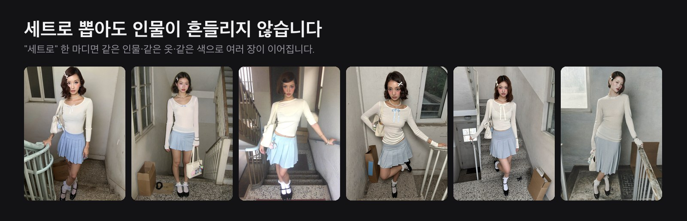

# soul2-prompt

<sub>[English README](README.en.md)</sub>

**한국어 한 줄이면 화보급 프롬프트가 나온다.** 힉스필드(Higgsfield) Soul 2.0 전용 이미지 프롬프팅 스킬입니다.

- `소울로 하나. 비 오는 날 편의점 앞 감성으로` 라고 치기만 하면 됩니다.
- 장소·인물·의상·조명·색 배합까지 스킬이 알아서 정합니다. 하나하나 물어보지 않습니다.
- 결과는 **① 설정값 라벨 줄 ② 힉스필드에 그대로 붙여넣는 영어 프롬프트(보통 1,200~2,200자) ③ 한국어 번역** 3단 세트로 나옵니다.


<sub>▶ [더 선명한 영상 파일(mp4)](docs/demo-v2.mp4) · 화면에 흐르는 영어 프롬프트는 실제 출력 원문 그대로입니다.</sub>

<br>

## ⬇️ 다운로드

### **[👉 최신 버전 내려받기 (Releases)](../../releases/latest)**

위 링크에서 `.skill` 파일을 받으세요. **`.zip` 파일도 같이 올려두었는데 내용은 완전히 같습니다.** 클로드 업로드 창에서 `.skill` 이 안 보이면 `.zip` 을 고르시면 됩니다.

(내려받지 않고 설치하는 방법은 바로 아래에 있습니다.)

<br>

## 설치법

### 제일 쉬운 방법: AI야, 해줘

쓰고 계신 AI 에이전트(클로드 코드, 코덱스, 크롬 붙은 클로드 등)에 이 한 줄만 치면 됩니다.

```
https://github.com/promptwhat/promptwhat-soul2-skill  이 스킬 설치해줘
```

에이전트의 브라우저 기능을 사용해 저장소를 열어 최신 파일을 받고 알아서 제자리에 넣습니다. **아래 과정은 안 읽으셔도 됩니다.**

<br>

<details>
<summary><b>손으로 넣고 싶다면 (펼치기)</b></summary>

<br>

**클로드 앱**

1. 먼저 **설정(Settings) → Capabilities** 에서 **코드 실행(code execution)** 을 켭니다.
   *이게 꺼져 있으면 스킬 메뉴 자체가 안 보입니다.*
2. **Customize → Skills** 로 갑니다 ([claude.ai/customize/skills](https://claude.ai/customize/skills)).
3. **+** → **Create skill** → **Upload a skill**
4. 내려받은 `.skill` 파일을 올립니다.

**코덱스(Codex)**

- 설치기를 쓰는 게 제일 빠릅니다. `$skill-installer` 에 위 저장소 주소를 주면 끝납니다.
- 손으로 넣으려면: `.skill` 압축을 풀어서 나온 `soul2-prompt-public` 폴더를 `~/.codex/skills/` 에 넣습니다 (`~/.agents/skills/` 도 됩니다). 그러면 매번 지시하지 않아도 알아서 발동합니다.

**그 외 에이전트**

압축을 풀어 `soul2-prompt-public` 폴더를 작업 폴더에 넣고, **"soul2-prompt-public/SKILL.md를 먼저 끝까지 읽고 그 규칙대로 소울 프롬프트를 써줘"** 라고 지시합니다.

</details>

<br>

## 이렇게 쓰면 됩니다

```
소울로 하나. 비 오는 날 편의점 앞 감성으로
```
```
소울로 하나. 여름 밤 놀이공원 청량하게, 6장 세트로
```
```
소울로 하나.
```
> 세 번째처럼 컨셉 없이 한 마디만 해도 됩니다. 그럴 땐 스킬이 컨셉부터 직접 잡습니다.

<br>

## 뭐라고 쳐야 할지 막힐 때

설치하고 나면 제일 먼저 막히는 것이 "그래서 뭐라고 치지?"입니다. 자주 쓰는 말을 한 장에 모아뒀습니다.

### **[👉 기본 명령어 모음 보기](docs/명령어-모음.md)**

아홉 개 절인데, 전부 읽지 마시고 **지금 하려는 것만 찾아보세요.**

| 하고 싶은 것 | 볼 곳 |
|---|---|
| 처음 한 장 뽑기 | 1. 시작하기 |
| 여러 장 이어서 뽑기 | 2. 여러 장 뽑기 |
| 사람이나 구도 바꾸기 | 3~4 |
| 스타일과 색감 바꾸기 | 5~7 |
| 나온 결과 손보기 | 8. 결과 고치기 |
| 무엇을 복사해 붙여넣는지 | 9. 결과 받아 쓰기 |

절마다 표 하나씩이고, 왼쪽 칸을 그대로 복사해 쓰시면 됩니다. 외울 필요는 없습니다.

<br>

## 이렇게까지 나옵니다



<br>



**12가지 컨셉, 각 3장씩 36컷입니다.** 동네 문구점 같은 생활 스냅부터 물이 차오른 복도·거대한 찻잔 같은 초현실 장면까지, 남성 인물과 클로즈업도 포함됩니다. 전부 같은 스킬이고 **한국어 한 줄만 바꿨습니다.**

<br>



<br>



`세트로` 라고 덧붙이면 여러 장이 나옵니다. **기본값이 「같은 인물 · 같은 옷」** 이라서, 인물 설정과 코디 문장을 장마다 통째로 물려주고 장면·구도만 바꿉니다. 색은 HEX 값으로 못 박아 함께 넘깁니다.

<sub>얼굴까지 더 조이는 방법이 두 가지 있습니다. **첫 장을 만들어 레퍼런스 이미지로 거는 방법**은 추가 비용 없이 유사도를 높여 주지만, 힉스필드 설명대로 장수가 많아지면 조금씩 흔들립니다. **여러 장·여러 날에 걸친 진짜 고정은 힉스필드의 Soul ID(Character 탭)** 입니다. 사진 20장 이상으로 인물을 미리 학습시켜 두는 기능이고, 요금제에 따라 쓸 수 있습니다. 스킬이 결과 끝에 두 방법을 안내해 줍니다.</sub>

<sub>반대로 장마다 다른 사람이 나오는 룩북형 세트를 원하면 `인물 바꿔가며` 라고 덧붙이면 됩니다.</sub>

<br>

## 실제 프롬프트 원문

**[→ 입력 한 줄 · 프롬프트 전문 · 결과 사진 3세트 보기](docs/examples.md)**

그 문서의 영어 프롬프트는 **옆에 붙은 사진을 실제로 만든 원문 그대로**입니다. 예시로 새로 쓴 게 아닙니다.

<br>

## 무엇을 근거로 만들었나

힉스필드 공식 **Soul Carousels** 프로젝트의 생성물 **136건 전수 분석**에서 나온 규칙만 담았습니다. 실측으로 확인되지 않은 값은 문서 안에 `[제안값]`으로 따로 표시해 두었습니다.

패키지에는 실측 원문 12선(`golden-prompts.md`)이 함께 들어 있습니다.

<br>

## 지우고 싶을 때

**폴더 하나만 지우면 완전히 사라집니다.** 이 스킬은 설치할 때 다른 파일을 만들지 않고, 어떤 서비스에도 등록하지 않으며, 예약 작업도 걸지 않습니다.

- **클로드** · `Customize → Skills` 에서 스킬을 고르고 끈 뒤, `…` 메뉴의 **Delete**
- **코덱스와 다른 에이전트** · 넣어둔 `soul2-prompt-public` 폴더를 통째로 삭제

내려받은 `.skill` 파일까지 버리면 흔적이 남지 않습니다.

<br>

## 제작

**프롬왓** · 인스타그램 [@prompt_what](https://instagram.com/prompt_what)

라이선스: [MIT](LICENSE)

<sub>MIT는 **스킬 본체**(규칙·구조·해설)에 적용됩니다. 패키지에 함께 든 `golden-prompts.md`의 영어 원문 12편은 힉스필드 공식 계정([@skxqw](https://higgsfield.ai/@skxqw/projects/soul-carousels))의 생성물로, 프롬프트 밀도를 가늠하는 참고 자료로 실었습니다. 이 원문들은 MIT 적용 대상이 아니며 권리는 원 작성자에게 있습니다.</sub>
