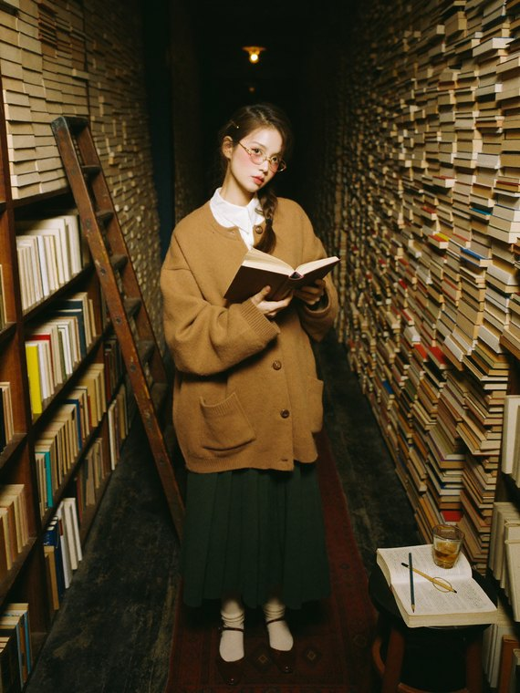
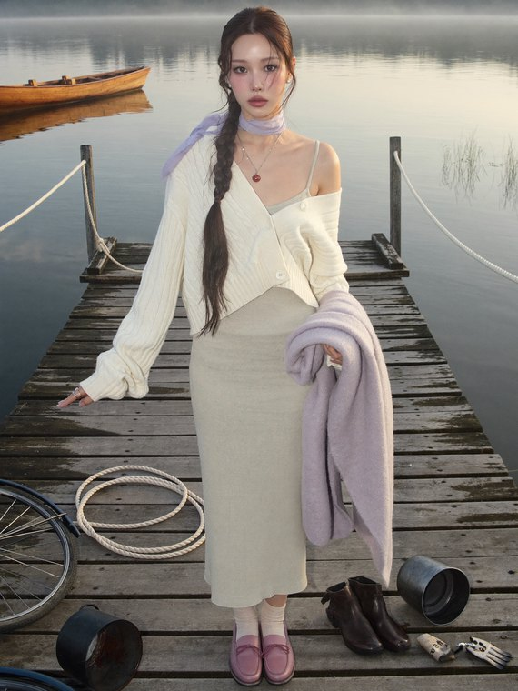
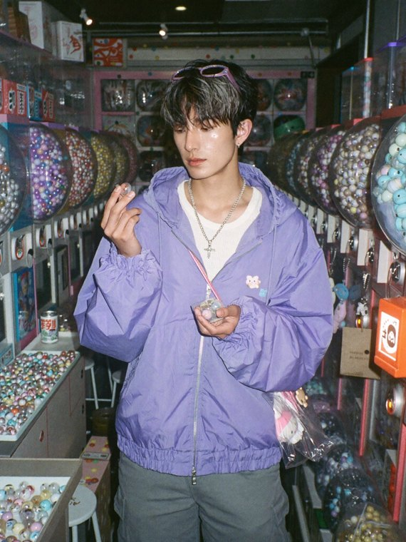

# 실제 결과 3세트 — 한 줄 입력에서 프롬프트, 그리고 사진까지

이 문서의 영어 프롬프트는 **아래 사진을 실제로 만든 원문 그대로**입니다. 예시로 새로 쓴 것이 아닙니다.

> 한국어 줄은 그 결과의 **컨셉을 한 줄로 압축한 것**입니다. 스킬은 이 정도만 받아도 아래 프롬프트를 만들어냅니다.

<br>

## 1. 헌책방 통로 — 1,743자

**입력**

```
소울로 하나. 천장까지 책이 쌓인 좁은 헌책방 통로에서
```

**나온 프롬프트**

```
A straight-on medium-wide shot captures a petite young East Asian woman in her early 20s standing in the narrow aisle of an old secondhand bookstore, where the stacked books rise impossibly high — towering columns of worn paperbacks climbing past the frame like canyon walls, leaning inward without falling. She has delicate refined features with softly rounded cheeks and large dark eyes; her dark brown hair is gathered in a loose low braid over one shoulder, a few strands escaping around her face. Her makeup is soft and warm — natural base, rosy flushed cheeks, a sheer brick-toned lip. She wears an oversized camel wool cardigan with leather buttons over a white pointed-collar cotton shirt, a long pleated skirt in deep forest green, ribbed cream socks and burgundy mary janes, with thin round gold-framed glasses and a small brass hairpin as accents. In both hands she holds an opened hardcover close to her chest, one finger keeping her page. The floor is scuffed dark hardwood with a worn runner rug; a rolling ladder leans against the shelves, a half-drunk glass of barley tea and a pencil rest on a stool, and the depths of the paper canyon dissolve into warm shadow, softly out of focus. The lighting comes from low tungsten pendant bulbs hanging between the stacks — warm, dim and directional, pooling amber light on her face and the book spines while the tops of the towers fade into darkness. The color palette is dominated by aged paper cream, amber, walnut brown and deep forest green, punctuated by burgundy echoed in her shoes, the rug and the clothbound spines. Shot on a film camera — slightly warm faded highlights, a hint of grain in the shadows, soft analog color. The mood is quietly surreal, introspective, and warm.
```

**결과**



**여기서 볼 것** — 버건디가 **신발·러그·책등** 세 곳에 반복됩니다(색 에코). 마지막 두 문장이 필름 카메라 마감과 무드를 따로 지정합니다.

<br>

## 2. 해 뜨기 전 호수 부두 — 3,010자

**입력**

```
소울로 하나. 해 뜨기 전 잔잔한 호수, 나무 부두 끝에서
```

**나온 프롬프트**

```
A straight-on, eye-level full-body editorial photograph of a slim, tall East Asian woman in her early twenties standing at the end of a weathered timber jetty on a still lake before sunrise. She has striking, delicate model-like features — high cheekbones, large expressive eyes, a fine nose and soft full lips. Her very long dark-chestnut hair is worked into a loose low three-strand braid pulled over one shoulder, softly undone with fine strands escaping around her face and the tail left unbound and slightly wavy. Her makeup is bare and glowing: dewy skin with a light sheen across the cheekbones, a soft lavender wash on the lids, groomed brows, faintly flushed cheeks and a pink-tinted balm on the lips. Her skin is cool porcelain with a faint natural flush at the nose from the cold air.

She wears an oversized cream cable-knit cardigan slipping off one shoulder, the cuffs pushed back and the hem hanging long, over a fitted pale sage ribbed knit midi dress that follows the line of her body to mid-calf. A sheer lavender silk scarf is knotted loosely at her throat with the tails drifting. Cream ribbed socks show above soft dusty-rose leather loafers. Her jewelry is small and cool: a rose-quartz pendant on a fine silver chain, tiny pearl studs, and one thin silver ring. Every garment is plain — no lettering, no logos, no brand marks, no printed motifs.

She carries a folded lavender wool blanket over one forearm, its edge trailing loose.

The jetty beneath her is old timber silvered by weather, the planks split and darkened at the joins with damp soaking through in patches. Beyond it the lake lies perfectly still under a low blanket of mist, a wooden rowboat moored at the far post barely holding its shape, and a stand of pale reeds breaking the surface near the bank. The morning's leavings sit on the planks: a coiled mooring rope, a pair of rubber boots left standing side by side, an overturned tin bucket, one work glove dropped palm-up, and a bicycle leaned against the jetty head. Further out, the far shore dissolves entirely into soft grey mist, completely out of focus.

Pre-sunrise light comes from everywhere and nowhere — the mist scatters it into a broad, directionless, almost shadowless glow that wraps her evenly and leaves only the faintest gradient under her jaw. The still water returns a cool silver fill from below, lifting the underside of the cardigan and the blanket edge.

The color palette is dominated by pale sage, cream, soft lavender, rose quartz and cool mist grey, punctuated by weathered silver timber and small bright silver detail. HEX VALUES: ["#24222b", "#35323f", "#474554", "#5d6b72", "#7b8a86", "#93a894", "#a79cc4", "#b3c4b0", "#c6bcdd", "#d9a8b4", "#d8cfc0", "#e8e0d2", "#eae9ef", "#edcfd6", "#f7f4ef", "#fdfbf8"]

A high-resolution contemporary digital editorial photograph — crisp edges, minimal noise, rich tonal depth and true color rendition, with the mist resolved as fine atmosphere rather than haze.

The mood is serene, luminous, and quietly poetic.
```

**결과**



**여기서 볼 것** — **색을 HEX 값 16개로 못 박습니다.** 세트로 여러 장 뽑을 때 색이 흔들리지 않는 이유가 이겁니다. 부두 위에 놓인 물건(로프·장화·양동이·장갑·자전거)이 "생활의 흔적"으로 따로 지정됩니다.

<br>

## 3. 오사카 뒷골목 뽑기방 — 3,538자

**입력**

```
소울로 하나. 오사카 뒷골목 뽑기방, 남자로
```

**나온 프롬프트**

```
A straight-on eye-level medium close-up of a young East Asian man in his early 20s standing in a cramped capsule-toy shop on a back street in Osaka in the late afternoon, framed from the chest up, one hand cupped and overflowing with small capsules while the other lifts a single capsule to eye height between thumb and forefinger, his head tilted slightly, one eye narrowed as he inspects it, the corner of his mouth caught halfway into a grin.

He is slim with clear symmetrical features — a defined jawline, large dark eyes with a sharp lower lash line, soft full lips. His hair is medium-length and black with a warm cool-ash rinse at the tips, grown out and loosely tousled with a middle part, the strands falling into his eyes and pushed back once already. He is clean-shaven with well-groomed brows and clear skin with a smooth matte finish, a natural flush across the nose and cheekbones from the warm shop air.

Filling the entire wall behind him and stacked from floor to ceiling are rows upon rows of capsule vending machines — dozens of identical chrome-handled units bolted into columns and banks, every glass dome packed tight with hundreds of plastic capsules in pastel lavender, mint, butter yellow, baby pink and translucent clear, the repetition running out of frame on both sides and dissolving into a soft wall of pastel bokeh a few machines back. More capsules are everywhere: scattered loose across the tiled floor around his feet, collected in a shallow cardboard tray on the counter, a few split open with their halves nested, and one balanced on the machine ledge beside his shoulder.

He wears an oversized lavender nylon half-zip hoodie, the zip open at the throat and the shell faintly glossy, its drawstring toggles mismatched; underneath, a fitted white ribbed long-sleeve top with the cuffs pulled down over the heels of his hands, a plain chest — no numbers, no lettering, no logos, no crests. Baggy pale grey cargo trousers with reflective piping down the outer seam sit low on his hips, held by a webbing belt with a chunky metal clasp. A flat silver chain hangs at his collarbone, translucent pink-framed glasses are pushed up into his hair, and a small nylon crossbody bag rides high on his chest with three plush charms and a keychain clipped to the strap.

The shop is narrow and low-ceilinged with cream vinyl floor tiles gone scuffed and grey in a walking path down the middle, a strip of fluorescent tubes overhead, and a coin-change machine in the corner with faded stickers layered across its front. A crumpled receipt and a discarded capsule half lie near his shoe, and a folding stool holds a half-drunk canned drink beading with condensation.

The lighting is soft, even and slightly cool — banks of overhead fluorescents plus the internal glow of the machines themselves throwing gentle pastel light up onto his face from below and laying almost no visible shadow, with a single hard specular highlight running along the chrome dial in front of him.

The color palette is dominated by pastel lavender, mint and cream, punctuated by butter yellow, baby pink, chrome silver and one hit of vivid neon orange from a machine at the frame's edge. Shot on the newest iPhone — crisp high resolution, clean sharp detail, true-to-life balanced colors, handheld casual framing. The mood is playful, candid and quietly surreal.

HEX VALUES: ["#2a2632", "#3c3648", "#5a5068", "#7d6f9c", "#a89ac8", "#c9b8e0", "#dfd4ee", "#a8d8c8", "#cfe8dc", "#f5c8d8", "#f7dcb0", "#f3ead8", "#faf6ee", "#c6c9cd", "#e6e9ec", "#ff7a2f"]
```

**결과**



**여기서 볼 것** — **남성도 같은 문법으로 씁니다.** 메이크업 대신 "깔끔하게 면도한 상태"로 바뀌고, 나머지 절차는 동일합니다. 옷마다 "글자·로고 없음"을 못 박는 것도 보입니다 — 생성물에 정체불명의 상표가 끼는 걸 막는 장치입니다.

<br>

---

세 프롬프트를 나란히 놓고 보면 순서가 같습니다.

**샷타입·앵글 → 인물(외모·헤어·메이크업·피부) → 의상 풀 코디 → 손 소품 → 배경 3층 → 조명 → 색 배합(+HEX) → 카메라 마감 → 무드**

이 순서가 스킬에 고정돼 있습니다. 컨셉만 바꿔 넣으면 이 뼈대에 맞춰 다시 채워집니다.
